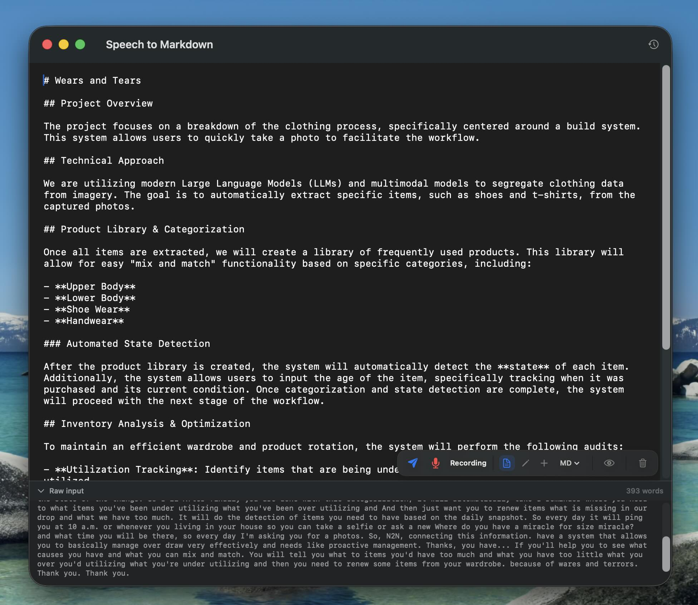
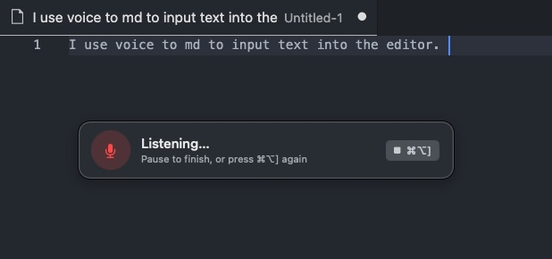
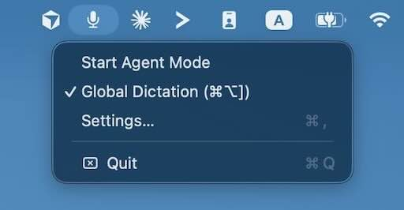
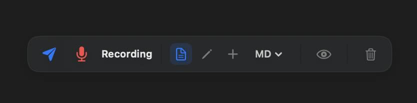
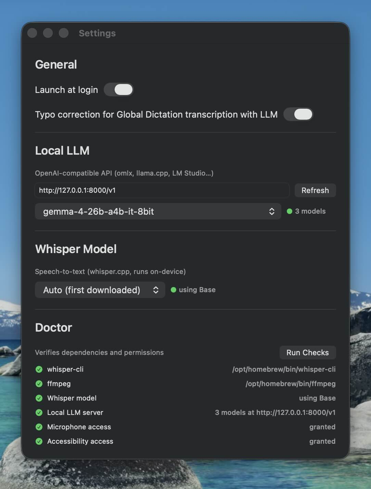

<p align="center">
  
</p>

<h1 align="center">🎙️ Voice-to-Markdown</h1>

<p align="center"><b>Talk. Get clean markdown. 100% local. 🔗 <a href="https://voice-to-md.xajik0.workers.dev/">voice-to-md.dev</a></b></p>

A macOS menu-bar app that turns your voice into structured markdown using [whisper.cpp](https://github.com/ggerganov/whisper.cpp) for speech-to-text and any local LLM for formatting. No cloud. No API keys. Nothing leaves your Mac.



*↑ This entire product spec was dictated by voice — a local LLM structured it in real time.*

## ✨ Two modes

- **⌨️ Global Dictation — `⌘⌥]` anywhere.** Speak, and the transcript is typed straight into whatever field has focus. Terminal, browser, Slack — anything. A Spotlight-style pill shows what's happening:

  

- **📝 Agent Mode — live markdown editor.** Speak freely; a local LLM streams your words into a clean, structured markdown document in real time. Raw transcript stays one click away. Start it from the menu bar:

  

## 🎛️ Agent Mode control panel

Everything in Agent Mode is driven from one floating, draggable capsule that hovers over the editor:



Left to right:

- **✈️ Send (`⌘↩`)** — don't wait for the auto-flush: transcribe whatever you just said and send it to the LLM *right now*. Enabled while recording and idle (no LLM call in flight).
- **🎙️ Mic** — start, pause, and resume the session. Red pulse = listening.
- **Status** — `Recording` / `Processing` / `Paused` at a glance, with errors surfaced inline.
- **Mode switcher** and **format dropdown** — how your voice is applied (see below) and what comes out: **MD** (default), **TXT**, or **HTML**. Each format ships its own expectations + example to the LLM, works in every mode, and the session file extension follows (`.md` / `.txt` / `.html` — switching mid-session renames the file). Your choice is remembered across launches.
- **👁️ Preview** — opens the session document in the default app for its type (browser for HTML, your editor for markdown/plain text).
- **🗑️ Trash** — clears the session (audio, transcript, and document) after a confirmation.

The modes:

| Mode | Icon | What it does |
|---|---|---|
| **Format** (default) | 📄 | The whole document + your new words go to the LLM, which returns the complete restructured document. Best for free-form dictation where the model keeps improving the overall structure. |
| **Edit** | ✏️ | Your voice is an **instruction**, not content: *"change the subtitle to Weekly Notes"*, *"turn that list into a table"*. Select text in the editor first and the model treats it as the focus of the edit. |
| **Append** | ➕ | Speed mode for long documents: only the **last 3 sentences** + your new words are sent, and the model returns just the new content, which is appended. The LLM never re-reads the whole file, so latency stays flat as the document grows. |

The flow underneath: audio is transcribed by whisper.cpp in ~4 s chunks and buffered; once ~30 words accumulate (or you pause for 5 s, or hit **Send**), the buffer is flushed to the LLM using the prompt for the current mode and output format — and tokens stream straight into the editor.

## 🚀 Quick Start

One line — installs dependencies, builds from source, and drops the app in /Applications:

```bash
curl -fsSL https://raw.githubusercontent.com/xajik/voice-to-md/main/install.sh | bash
```

Or from a checkout:

```bash
git clone https://github.com/xajik/voice-to-md.git && cd voice-to-md
make install       # deps + build + copy to /Applications
# …or for development: make setup && make run
```

First launch: grant **Microphone** + **Accessibility** access, then download a Whisper model from **Settings…** in the menu bar (Base is a great start).

**Signing:** builds are automatically signed with your "Apple Development" identity when one is in the keychain, so re-installs keep their Microphone/Accessibility grants. No identity → ad-hoc fallback (macOS will re-ask for permissions after updates). Override with `make install SIGN_IDENTITY="…"`.

## 🧠 Local LLM Setup (Agent Mode)

Agent Mode talks to any **OpenAI-compatible** server. Point VTMD at it in **Settings…** (default: `http://127.0.0.1:8000/v1`, model auto-picked). The Whisper STT model is picked there too:



Pick your server:

### omlx (Apple Silicon, MLX — fastest on Mac)

Serve any MLX model on port 8000 — VTMD's default, zero config needed:

```bash
brew install omlx
omlx serve Qwen3.5-27B-Claude-4.6-Opus-Distilled-MLX-4bit
```

### Ollama

```bash
brew install ollama
ollama pull qwen3.5        # or: ollama pull gemma3
ollama serve
```

Base URL: `http://127.0.0.1:11434/v1`

### LM Studio

Download from [lmstudio.ai](https://lmstudio.ai), grab a model, start the local server.
Base URL: `http://127.0.0.1:1234/v1`

### llama.cpp

```bash
brew install llama.cpp
llama-server -m your-model.gguf --port 8080
```

Base URL: `http://127.0.0.1:8080/v1`

### 🏆 Recommended models

| Model | Why |
|---|---|
| **Qwen3.5 27B** (4-bit) | Best formatting quality; the default pick |
| **Gemma 26B** (8-bit) | Fast, great instruction following |

Anything that follows instructions well works — VTMD streams tokens as they arrive, so even bigger models *feel* instant.

## 🛠️ Development

```bash
make check      # verify dependencies
make build      # release build + sign
make test       # unit tests
make generate   # regen .xcodeproj after editing project.yml
make install    # build + install to /Applications
make uninstall  # remove from /Applications
```

Everything runs on-device: AVAudioEngine → whisper.cpp → local LLM → your screen. That's the whole pipeline.
