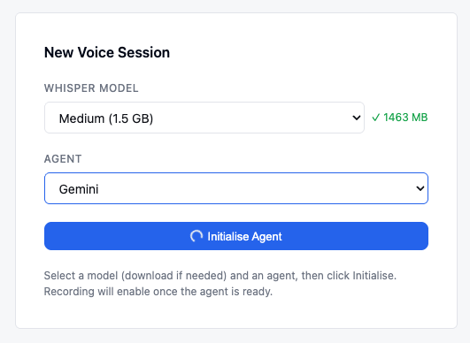
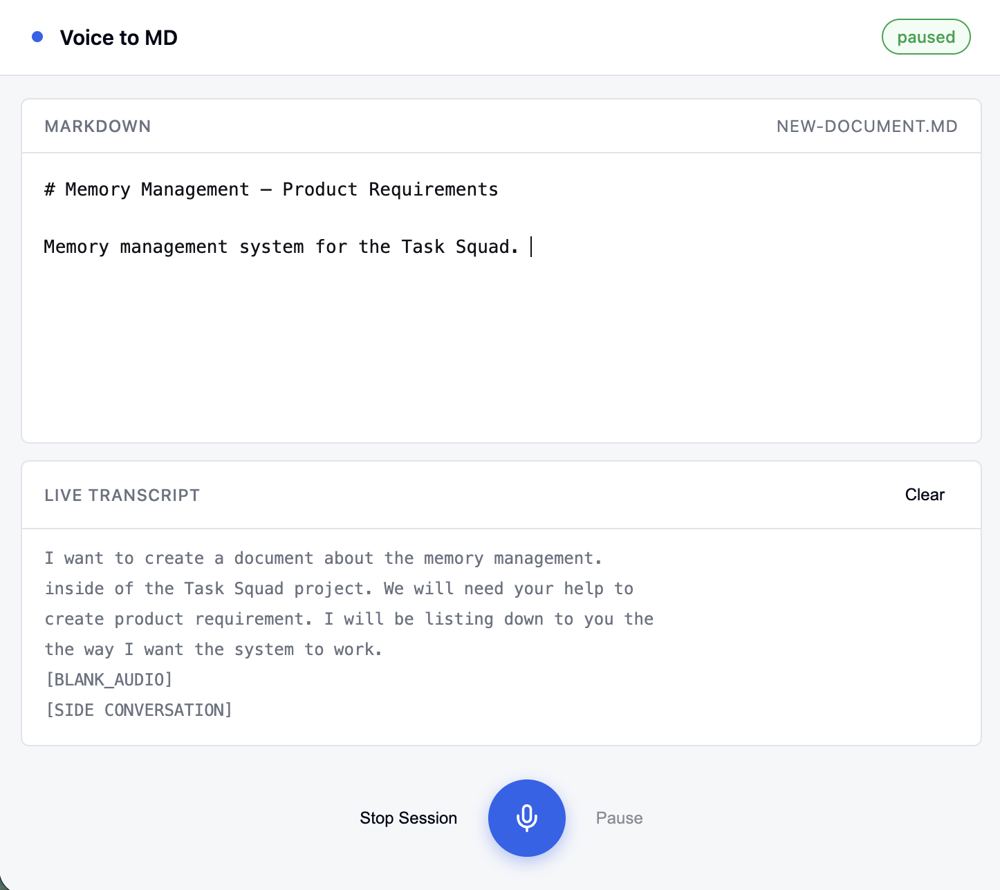

# 🎙️ Voice-to-Markdown

**Talk. Get clean markdown. 100% local.**

A macOS menu-bar app that turns your voice into structured markdown using [whisper.cpp](https://github.com/ggerganov/whisper.cpp) for speech-to-text and any local LLM for formatting. No cloud. No API keys. Nothing leaves your Mac.

| Model Selection | Live Markdown Agent |
|---|---|
|  |  |

## ✨ Two modes

- **⌨️ Global Dictation — `⌘⌥]` anywhere.** Speak, and the transcript is typed straight into whatever field has focus. Terminal, browser, Slack — anything.
- **📝 Agent Mode — live markdown editor.** Speak freely; a local LLM streams your words into a clean, structured markdown document in real time. Raw transcript stays one click away.

## 🚀 Quick Start

```bash
brew install xcodegen whisper-cpp ffmpeg   # dependencies
git clone https://github.com/xajik/voice-to-md.git && cd voice-to-md
make setup && make run
```

First launch: grant **Microphone** + **Accessibility** access, then download a Whisper model from **Settings…** in the menu bar (Base is a great start).

## 🧠 Local LLM Setup (Agent Mode)

Agent Mode talks to any **OpenAI-compatible** server. Point VTMD at it in **Settings… → Backend** (default: `http://127.0.0.1:8000/v1`, model auto-picked).

Pick your server:

### omlx (Apple Silicon, MLX — fastest on Mac)

Serve any MLX model on port 8000 — VTMD's default, zero config needed:

```bash
brew install omlx
omlx serve Qwen3.5-27B-Claude-4.6-Opus-Distilled-MLX-4bit
```

### Ollama

```bash
brew install ollama
ollama pull qwen3.5        # or: ollama pull gemma3
ollama serve
```

Base URL: `http://127.0.0.1:11434/v1`

### LM Studio

Download from [lmstudio.ai](https://lmstudio.ai), grab a model, start the local server.
Base URL: `http://127.0.0.1:1234/v1`

### llama.cpp

```bash
brew install llama.cpp
llama-server -m your-model.gguf --port 8080
```

Base URL: `http://127.0.0.1:8080/v1`

### 🏆 Recommended models

| Model | Why |
|---|---|
| **Qwen3.5 27B** (4-bit) | Best formatting quality; the default pick |
| **Gemma 26B** (8-bit) | Fast, great instruction following |

Anything that follows instructions well works — VTMD streams tokens as they arrive, so even bigger models *feel* instant.

## 🛠️ Development

```bash
make check     # verify dependencies
make build     # release build
make test      # unit tests
make generate  # regen .xcodeproj after editing project.yml
```

Everything runs on-device: AVAudioEngine → whisper.cpp → local LLM → your screen. That's the whole pipeline.
